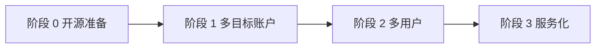
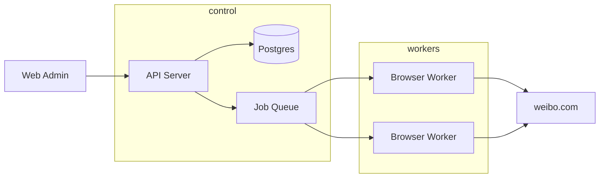

# weibo-auto-forward

微博自动转发工具：抓取指定源账号的新微博，用 LLM 生成转发评语，并通过 Playwright 完成转发与记录。

> **说明**：本项目为个人自动化工具，与微博官方无关。使用自动化可能违反平台服务条款，存在账号限制等风险，请自行评估并承担责任。

---

## 快速开始

### 环境要求

- Node.js 18+
- [Playwright](https://playwright.dev/) 浏览器依赖（首次需 `npx playwright install chromium`）
- 本机已安装 [`qwen`](https://github.com/QwenLM/qwen-code) CLI（用于生成转发文案）

### 安装与配置

```bash
npm install
cp .env.example .env
```

**方式 A：规则文件（推荐，多源账号）**

```bash
cp rules.yaml.example rules.yaml
# 编辑 rules.yaml：accounts、rules（源 UID、limit）
```

**方式 B：兼容模式（单源账号）**

在 `.env` 中设置 `SOURCE_UID`、`FORWARD_LIMIT` 等。

### 登录

```bash
# 默认账号（兼容模式，登录态在 data/storageState.json）
npm run auth:login

# 规则文件中的账号
npx tsx src/cli.ts auth login --account my-main
```

登录态按账号保存在 `data/storageState.json` 或 `data/accounts/{id}/storageState.json`（勿提交仓库）。

### 转发

```bash
# 规则模式
npx tsx src/cli.ts forward --rule rule-brand
npx tsx src/cli.ts forward --all
npx tsx src/cli.ts forward --rule rule-brand --dry-run

# 兼容模式（.env 中的 SOURCE_UID）
npm run forward
npx tsx src/cli.ts forward --uid 1234567890 --limit 3 --dry-run
```

### 数据文件

| 文件 | 用途 |
|------|------|
| `rules.yaml` | 转发账号与规则（见 `rules.yaml.example`） |
| `data/storageState.json` | 默认账号登录态 |
| `data/accounts/{id}/` | 非 default 账号的数据与登录态 |
| `data/forwarded-posts.csv` | 已转发源微博（按 source_uid 去重） |
| `data/forwarded.json` | 转发记录（JSON 备份） |
| `data/my-repost-links.csv` | 自己的转发微博链接（按日期分列） |
| `data/errors/` | 失败截图 |

---

## 阶段 2：多用户 API + Docker Compose 部署

阶段 2 在单机基础上增加了 **SQLite 多用户** 与 **HTTP API**。每个平台用户拥有独立的转发账号、规则与转发记录；微博登录态保存在 `data/tenants/{userId}/` 目录。

> CLI（`rules.yaml`）与 API 模式可并存：个人自用仍可用 CLI；多人共用或远程触发请用 API + Docker。

### 一键部署

```bash
cp .env.docker.example .env
# 编辑 .env，至少修改 ADMIN_PASSWORD

docker compose up -d --build
curl http://localhost:3000/health
```

容器首次启动会自动创建 SQLite 数据库（`data/app.db`）与默认管理员（`ADMIN_USERNAME` / `ADMIN_PASSWORD`）。数据目录 `./data` 挂载到容器内 `/app/data`，包含数据库与各租户登录态。

| 环境变量 | 说明 | 默认 |
|----------|------|------|
| `PORT` | 宿主机映射端口 | `3000` |
| `ADMIN_USERNAME` | 初始管理员用户名 | `admin` |
| `ADMIN_PASSWORD` | 初始管理员密码 | `changeme` |
| `ALLOW_REGISTER` | 是否开放注册 | `true` |
| `HEADLESS` | Playwright 无头模式 | `true` |
| `SKIP_WEIBO_HOME_VERIFY` | 跳过微博首页登录校验 | `1` |
| `COMMENT_GENERATOR` | 评语：`api`（云端）/ `cli`（本机命令行） | Docker 默认 `api` |
| `QWEN_API_KEY` | DashScope API Key（Docker 必填） | — |
| `QWEN_API_BASE` | OpenAI 兼容接口地址 | 见 `.env.docker.example` |
| `QWEN_MODEL` | 模型名 | `qwen-plus` |
| `CRON_ENABLED` | 是否启用规则定时任务 | `true` |
| `CRON_TZ` | Cron 时区 | `Asia/Shanghai` |
| `PUBLIC_BASE_URL` | 扫码登录页对外根 URL | `http://localhost:3000` |

### 本地开发 API

```bash
npm run start:api
# API: http://localhost:3000
# 管理控制台: http://localhost:3000/admin/
```

浏览器打开 **http://localhost:3000/admin/**，使用管理员账号登录后可：
- 管理转发微博账号（扫码登录 / 上传登录态）
- 配置转发规则与 Cron
- 一键执行 / 试运行转发任务

### API 使用流程

**1. 登录获取 API Key**

```bash
curl -s -X POST http://localhost:3000/api/v1/auth/login \
  -H 'Content-Type: application/json' \
  -d '{"username":"admin","password":"changeme"}'
```

响应中的 `apiKey` 用于后续请求（`Authorization: Bearer <apiKey>` 或 `X-Api-Key` 头）。

**2. 创建转发微博账号**

```bash
curl -s -X POST http://localhost:3000/api/v1/accounts \
  -H "Authorization: Bearer $API_KEY" \
  -H 'Content-Type: application/json' \
  -d '{"name":"my-main"}'
```

**3. 绑定微博登录态（二选一）**

**方式 A：Web 扫码登录（推荐）**

```bash
curl -s -X POST "http://localhost:3000/api/v1/accounts/$ACCOUNT_ID/login-sessions" \
  -H "Authorization: Bearer $API_KEY"
```

响应含 `webUrl`，在浏览器打开该链接，用微博 App 扫码；成功后登录态自动写入 `data/tenants/.../storageState.json`。

**方式 B：本机登录后上传 JSON**

```bash
npm run auth:login
./scripts/upload-storage-state.sh http://localhost:3000 "$API_KEY" "$ACCOUNT_ID"
```

**4. 创建并执行转发规则**

```bash
# 创建规则（schedule 为可选 cron，例如每天 9:00）
curl -s -X POST http://localhost:3000/api/v1/rules \
  -H "Authorization: Bearer $API_KEY" \
  -H 'Content-Type: application/json' \
  -d '{"forwardAccountId":"'"$ACCOUNT_ID"'","sourceUid":"1234567890","limit":1,"schedule":"0 9 * * *"}'

# 执行单条规则（可加 {"dryRun":true} 试运行）
curl -s -X POST "http://localhost:3000/api/v1/rules/$RULE_ID/run" \
  -H "Authorization: Bearer $API_KEY" \
  -H 'Content-Type: application/json' \
  -d '{}'

# 执行全部已启用规则
curl -s -X POST http://localhost:3000/api/v1/rules/run-all \
  -H "Authorization: Bearer $API_KEY" \
  -H 'Content-Type: application/json' \
  -d '{}'
```

### 主要 API 端点

| 方法 | 路径 | 说明 |
|------|------|------|
| `GET` | `/health` | 健康检查 |
| `POST` | `/api/v1/auth/register` | 注册（`ALLOW_REGISTER=false` 时关闭） |
| `POST` | `/api/v1/auth/login` | 登录，返回 API Key |
| `GET` | `/api/v1/me` | 当前用户信息 |
| `GET/POST/DELETE` | `/api/v1/accounts` | 转发微博账号 CRUD |
| `POST` | `/api/v1/accounts/:id/storage-state` | 上传 Playwright 登录态 |
| `POST` | `/api/v1/accounts/:id/login-sessions` | 发起 Web 扫码登录 |
| `GET` | `/api/v1/accounts/:id/login-sessions/:sid` | 查询扫码进度 |
| `GET` | `/admin/` | Web 管理控制台 |
| `GET` | `/web/login.html` | 扫码页面（需 sessionId + token） |
| `GET/POST/PATCH/DELETE` | `/api/v1/rules` | 转发规则 CRUD（含 `schedule` cron） |
| `POST` | `/api/v1/rules/:id/run` | 手动执行单条规则 |
| `POST` | `/api/v1/rules/run-all` | 执行全部已启用规则 |

### 持久化说明

| 路径 | 用途 |
|------|------|
| `data/app.db` | SQLite（用户、账号、规则、转发记录） |
| `data/tenants/{userId}/accounts/{accountId}/storageState.json` | 各租户微博登录态 |
| `data/tenants/.../login-sessions/*.png` | 扫码登录二维码截图 |

### 评语生成模式

| 场景 | 配置 |
|------|------|
| 本机 CLI / 开发 | 安装 `qwen` CLI，不设 `QWEN_API_KEY`（或 `COMMENT_GENERATOR=cli`） |
| Docker / 服务器 | `.env` 中设置 `QWEN_API_KEY`，`COMMENT_GENERATOR=api` |

### Cron 示例

| 表达式 | 含义 |
|--------|------|
| `0 9 * * *` | 每天 9:00（`CRON_TZ` 时区） |
| `0 */2 * * *` | 每 2 小时 |
| `30 8 * * 1-5` | 工作日 8:30 |

修改规则的 `schedule` 后 API 会自动重载调度器。

---

## 当前架构

单机、单租户 CLI 脚本，核心特征如下：

| 维度 | 现状 |
|------|------|
| 入口 | `src/cli.ts`：`auth login`、`forward` |
| 配置 | `rules.yaml`（多规则）或 `.env`（单源兼容） |
| 登录态 | 按账号分目录 `data/accounts/{id}/storageState.json` |
| 持久化 | 按账号分目录 CSV + JSON |
| 执行 | 本机 Playwright，`forward --rule` / `--all` |
| 文案 | 本机 `qwen` 子进程（`src/generator.ts`） |
| 编排 | `src/core/JobRunner` 串联抓取 → 生成 → 转发 |

主要模块：

- `src/core/` — `WeiboClient`、`CommentGenerator`、`ForwardRepository`、`JobRunner` 接口与默认实现
- `cli.ts` — 解析参数，调用 `JobRunner`
- `auth.ts` / `scraper.ts` / `publisher.ts` — 微博自动化底层
- `store.ts` / `forwarded-posts-csv.ts` / `link-csv.ts` — 持久化（由 `FileForwardRepository` 使用）
- `generator.ts` — 评语生成（由 `QwenCliCommentGenerator` 使用）

当前**已具备**：SQLite 多用户、REST API、Docker Compose、Web 扫码登录、规则 Cron、Qwen API 评语（Docker）/ CLI 评语（本地）。**尚未**具备：任务队列、远程 Worker、Web 管理后台。

---

## 演化路线图

目标：**开源可维护**、**支持多用户与多目标账号**、**可服务化部署**（API + 队列 + Worker）。

建议分四个阶段推进，避免一开始上微服务；Playwright 浏览器才是主要瓶颈。



---

### 阶段 0：开源准备（不改架构也能做）

**目标**：仓库可公开、边界清晰、便于贡献与测试。

1. **仓库卫生**
   - 补充 `LICENSE`、`CONTRIBUTING`
   - `README` 写清用途、风险、非官方声明
   - `.env.example` 说明各配置项；`data/`、密钥永不入库

2. **抽取核心边界**（为后续阶段铺路）

   | 抽象 | 职责 |
   |------|------|
   | `WeiboClient` | 登录、抓时间线、执行转发 |
   | `CommentGenerator` | 评语生成（qwen / HTTP LLM / 模板） |
   | `ForwardRepository` | 已转发记录、我的链接 |
   | `JobRunner` | 一次完整的 forward 任务编排 |

3. **CLI 变薄**

   `cli.ts` 只负责解析参数、组装依赖、调用 `JobRunner`。

---

### 阶段 1：多目标账户（仍单机、仍 CLI）

**目标**：一个转发微博号，关注多个源账号；每条规则独立配置与去重。

配置从「单个 `SOURCE_UID`」升级为**转发规则列表**，例如 `rules.yaml`：

```yaml
accounts:
  - id: my-main
    storageState: data/accounts/my-main/storageState.json

rules:
  - id: rule-a
    forwardAccountId: my-main    # 用哪个微博号去转
    sourceUid: "111111"
    limit: 3
    schedule: "0 9 * * *"      # 可选，cron
    promptProfile: default
  - id: rule-b
    forwardAccountId: my-main
    sourceUid: "222222"
    limit: 1
```

CLI 演进示例：

```bash
weibo-forward auth login --account my-main
weibo-forward forward --rule rule-a
weibo-forward forward --all
```

**数据隔离维度**：`(forwardAccountId, sourceUid)`，而非全局单文件。

- `forwarded_posts(forward_account_id, source_uid, mid, source_url, forwarded_at)`
- `my_repost_links(forward_account_id, date, link1, link2, …)`

**存储**：可先按目录拆分 `data/accounts/{accountId}/...`，或引入 SQLite（单机多规则足够）。

---

### 阶段 2：多用户（可不立刻服务化）

**目标**：平台上有多个使用者，每人管理自己的微博号与规则。

> 此处的「用户」指**平台账号**（你的 SaaS 用户），不是微博 UID。

核心实体：

```
User（平台用户）
  └── ForwardAccount（绑定的微博号，对应一份 storageState）
        └── ForwardRule（源 UID、limit、prompt、开关、调度）
              └── ForwardJob / ForwardRecord
```

要点：

- 每个 `ForwardAccount` 独立 Playwright `storageState`（加密存库或对象存储）
- Repository 所有读写强制带 `user_id` / `tenant_id`
- 登录：Web 扫码 → 回调保存 session，替代每人本地跑 `npm run auth:login`

单机多用户可用 **SQLite + 分目录**；真正多人并发再进入阶段 3。

---

### 阶段 3：服务化（API + 队列 + Worker）

**目标**：远程触发、定时调度、多 worker、可观测、可重试。



#### 控制面（API）示例

| 方法 | 路径 | 说明 |
|------|------|------|
| `POST` | `/accounts` | 创建转发号 |
| `POST` | `/accounts/:id/login-sessions` | 发起扫码登录 |
| `GET` | `/accounts/:id/login-sessions/:sid` | 轮询登录结果 |
| `CRUD` | `/rules` | 源账号、limit、prompt、cron |
| `POST` | `/rules/:id/run` | 手动触发 |
| `GET` | `/jobs/:id` | 任务状态、日志、截图 |

#### 执行面（Worker）

- 从队列消费 `ForwardJob`（含 `forwardAccountId`、`sourceUid`、`limit`、`dryRun`）
- 每个任务使用**独立 BrowserContext**（隔离 cookie）
- 任务状态：`pending → running → succeeded | failed | dead`
- **幂等**：`(forward_account_id, source_uid, mid)` 唯一约束，防止重复转发
- 同一 `forwardAccountId` 建议**串行**（风控 + 资源）；不同账号可并行

#### 调度

- Cron / BullMQ / Temporal 按 `ForwardRule` 生成 job
- 失败指数退避；敏感错误告警

#### 文案生成

- `CommentGenerator` 接口 + 多 Provider（`QwenCli` 开发、`HttpLlm` 生产）
- Worker 不依赖本机 `qwen`；按 tenant 配置 API Key 与配额

#### 最小可行服务化（MVP）

| 组件 | 选型 |
|------|------|
| 数据库 | Postgres（users、accounts、rules、records、jobs） |
| 队列 | Redis + BullMQ |
| Worker | 单进程或多实例消费队列 |
| API | REST + 鉴权 |
| CLI | 保留，调用同一套 `core`，便于自托管与调试 |

**不建议**一开始拆微服务；单体 API + Worker + Postgres + Redis 即可。

---

## 与现有代码的映射

| 现有模块 | 演化方向 |
|----------|----------|
| `config.ts` / `AppConfig` | → `ForwardRule` + 从 DB / 配置文件加载 |
| `auth.ts`、固定 `STORAGE_STATE_PATH` | → `SessionStore.get(forwardAccountId)` |
| `store.ts`、CSV 文件 | → `ForwardRepository`（表含 `forward_account_id`、`source_uid`） |
| `link-csv.ts` | → 合并进 `repost_links` 表或同类 Repository |
| `publisher.ts`、`scraper.ts` | → `packages/core`，不依赖 `DATA_DIR` |
| `cli.ts` | → `packages/cli`；另增 `packages/api`、`packages/worker` |
| `generator.ts` | → `CommentGenerator` Provider 可插拔 |

### 建议的 Monorepo 结构

```
packages/
  core/      # 类型、domain、repository 接口、微博自动化
  cli/       # 本地开发 / 自托管
  api/       # HTTP + 鉴权
  worker/    # Playwright 队列消费者
apps/
  web/       # 可选：管理后台
```

---

## 开源与服务化注意事项

1. **Playwright 资源重**：按账号限并发；专用 worker 机器；`headless` 可配置。
2. **登录态即凭证**：`storageState` 需加密存储、访问审计、过期检测与重新登录流程。
3. **风控与限速**：保留随机延迟；按账号 QPS；失败退避。
4. **页面结构变化**：`selectors.ts` 版本化或远程配置，便于 hotfix。
5. **合规**：README 标明非官方、自担风险；公有云代运营需额外评估法律责任。
6. **可观测性**：结构化日志、错误截图（已有 `data/errors/`）、成功率与耗时指标。

---

## 推荐实施顺序

| 顺序 | 内容 | 主要收益 |
|------|------|----------|
| 1 | 抽取 `core` + Repository 接口；数据按 `(account, source)` 分目录 | 可测试、可开源 |
| 2 | `rules.yaml` 多源账号 + 多 `storageState` | 解决多目标 |
| 3 | SQLite + `forward --all` | 单机产品化 |
| 4 | API + 队列 + Worker + Web 登录流程 | 服务化 |
| 5 | Web 管理台、监控、LLM 插件化 | 生态与运维 |

**务实建议**：开源第一阶段完成**阶段 0 + 阶段 1**即可（规则化 + 分账户数据 + 文档）；确认有多人共用需求后再投入 API / Worker。

---

## 部署形态选择

| 形态 | 适用场景 |
|------|----------|
| **纯 CLI 自托管** | 个人、小团队，cron 定时跑 |
| **单机 + SQLite + 规则文件** | 多源账号、仍在一台机器 |
| **API + Worker + Postgres** | 多用户、远程触发、调度与审计 |

---

## 许可证

[MIT](LICENSE)
