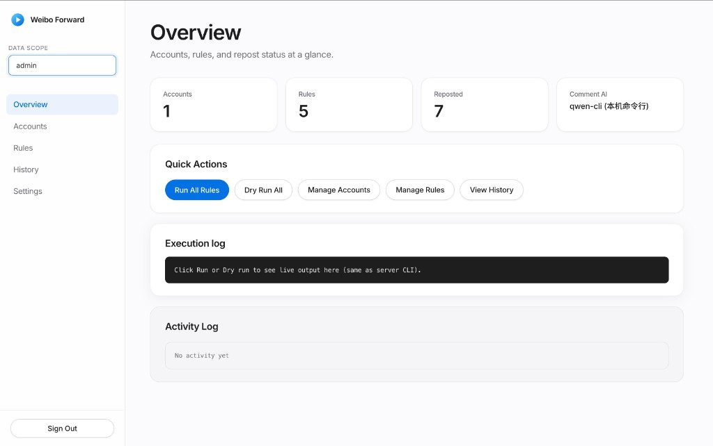
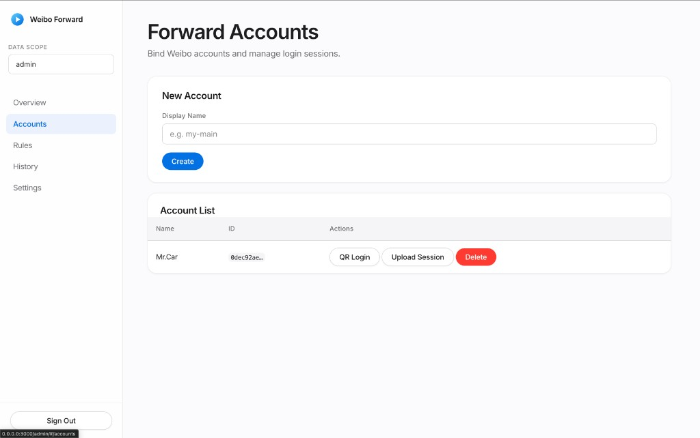
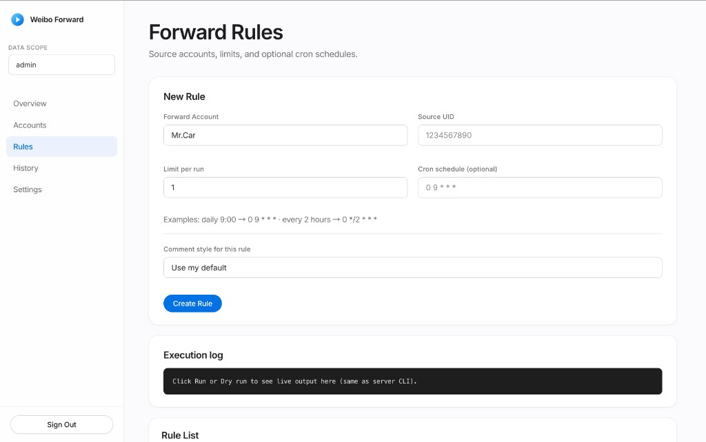
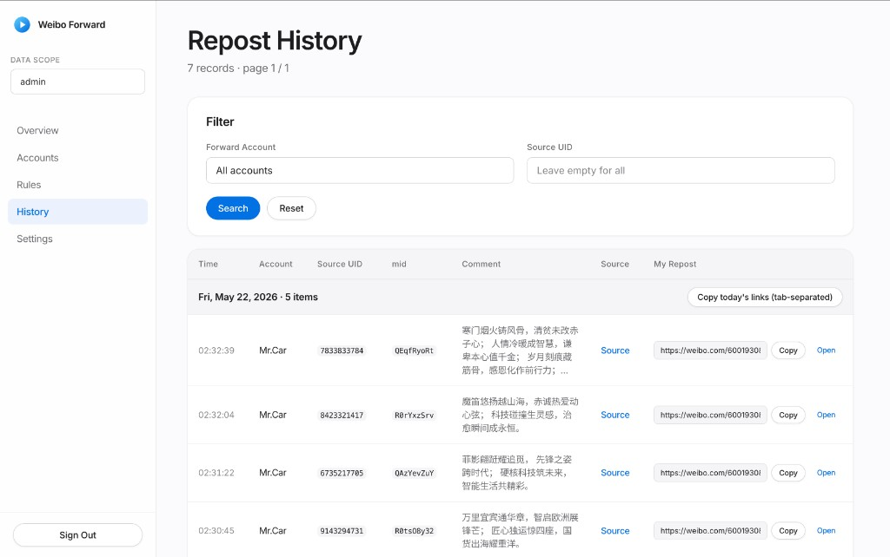
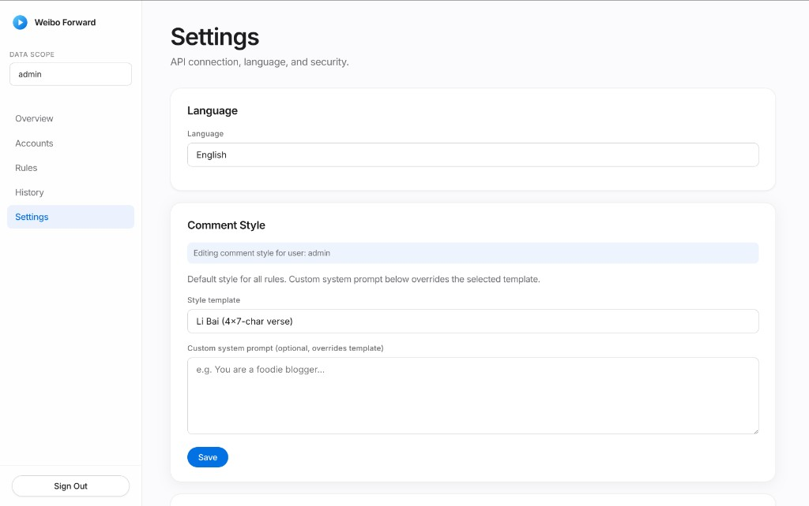
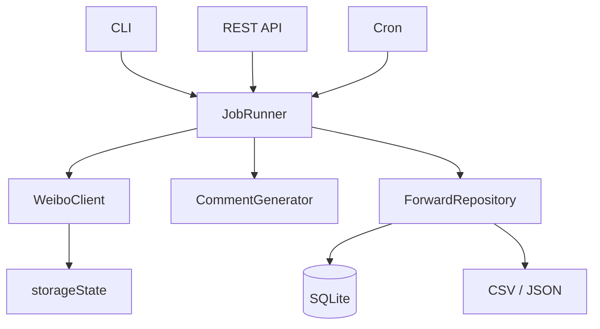

# weibo-auto-forward

English | [简体中文](README.zh-CN.md)

[](LICENSE)

Automates Weibo reposts: watch a source account’s timeline, generate repost text with Qwen (CLI or HTTP API), and submit the repost via Playwright. Supports local CLI (`rules.yaml`) and a multi-user HTTP API with a web admin UI.

**Not affiliated with Weibo.** Automation may violate platform terms and can lead to rate limits or account restrictions. Use at your own risk.

## Contents

- [Screenshots](#screenshots)
- [Requirements](#requirements)
- [Quick start (CLI)](#quick-start-cli)
- [Quick start (Docker)](#quick-start-docker)
- [What it does](#what-it-does)
- [Deployment modes](#deployment-modes)
- [Configuration](#configuration)
- [Web admin](#web-admin)
- [User guide (ZH)](#user-guide-zh)
- [API](#api)
- [Architecture](#architecture)
- [Data paths](#data-paths)
- [Roadmap](#roadmap)
- [Development](#development)
- [Security](#security)
- [Star History](#star-history)
- [License](#license)

## Screenshots

Web admin at `http://localhost:3000/admin/` (after `npm run start:api` or `docker compose up`).

| Overview | Accounts |
|:---:|:---:|
| Dashboard, run/dry-run, execution log | Bind accounts, QR login, upload session |
|  |  |

| Rules | History |
|:---:|:---:|
| Source UID, limit, cron, comment style | Filter and copy repost links |
|  |  |

**Settings** — API base URL, language (EN/ZH), comment templates and custom system prompt.



## Requirements

- Node.js 18+
- Chromium for Playwright: `npx playwright install chromium`
- [qwen CLI](https://github.com/QwenLM/qwen-code) for local comment generation (CLI mode)
- Docker (optional) for API deployment with cloud Qwen API

## Quick start (CLI)

```bash
git clone https://github.com/MrCare/weibo-auto-forward.git
cd weibo-auto-forward
npm install
npx playwright install chromium

cp .env.example .env
cp rules.yaml.example rules.yaml
# Edit rules.yaml: set sourceUid and accounts

npm run auth:login
npx tsx src/cli.ts forward --rule rule-brand --dry-run
npx tsx src/cli.ts forward --rule rule-brand
```

`--dry-run` generates comments and skips the actual repost.

## Quick start (Docker)

```bash
cp .env.docker.example .env
# Set ADMIN_PASSWORD and QWEN_API_KEY

docker compose up -d --build
```

Open `http://localhost:3000/admin/`. On first start, SQLite and the admin user are created from `ADMIN_USERNAME` / `ADMIN_PASSWORD`.

## What it does

1. Load rules (source UID, limit, schedule).
2. Fetch new posts from the source timeline (Playwright).
3. Skip posts already recorded for `(forward account, source UID, mid)`.
4. Generate repost comment text (Qwen CLI or DashScope-compatible API).
5. Perform the repost in the browser and persist records (CSV and/or SQLite).

**CLI:** `rules.yaml`, per-account `storageState` under `data/accounts/`.

**API:** SQLite users/accounts/rules, tenant-scoped `storageState`, REST + Bearer API key, optional cron per rule, QR login page.

## Deployment modes

| | CLI | Docker / API |
|---|-----|----------------|
| Use case | Single machine, cron | Server, multiple users |
| Config | `rules.yaml`, `.env` | `.env` (see `.env.docker.example`) |
| Comments | Local `qwen` CLI | `QWEN_API_KEY` |
| Login | `npm run auth:login` | QR session or upload `storageState` |

Both modes can coexist (CLI locally, API on a server).

### Example `rules.yaml`

```yaml
accounts:
  - id: my-main

rules:
  - id: rule-brand
    forwardAccountId: my-main
    sourceUid: "1234567890"
    limit: 1
    enabled: true
    # schedule: "0 9 * * *"
```

## Configuration

<details>
<summary>CLI (.env.example)</summary>

| Variable | Description |
|----------|-------------|
| `SOURCE_UID` | Source account UID (legacy single-source mode) |
| `FORWARD_LIMIT` | Max posts per run |
| `HEADLESS` | Headless browser |
| `DRY_RUN` | Skip repost, only generate text |
| `QWEN_API_KEY` | If set, uses HTTP API for comments |

</details>

<details>
<summary>Docker / API (.env.docker.example)</summary>

| Variable | Default | Description |
|----------|---------|-------------|
| `PORT` | `3000` | Listen port |
| `ADMIN_USERNAME` | `admin` | Initial admin |
| `ADMIN_PASSWORD` | `changeme` | Change before deploy |
| `ALLOW_REGISTER` | `true` | User registration |
| `QWEN_API_KEY` | — | DashScope API key |
| `QWEN_MODEL` | `qwen-plus` | Model name |
| `CRON_ENABLED` | `true` | Rule schedules |
| `CRON_TZ` | `Asia/Shanghai` | Cron timezone |
| `PUBLIC_BASE_URL` | `http://localhost:3000` | Base URL for QR login page |
| `HEADLESS` | `true` | Headless Playwright |

</details>

Cron examples: `0 9 * * *` (daily 09:00), `0 */2 * * *` (every 2 hours), `30 8 * * 1-5` (weekdays 08:30).

## Web admin

See [Screenshots](#screenshots). Manage accounts, rules, cron, jobs (including dry-run), history, and prompt settings. UI supports English and Chinese.

QR login: create account → `POST .../login-sessions` → open `webUrl` → scan with the Weibo app → session saved under `data/tenants/`.

## User guide (ZH)

For a step-by-step Chinese guide covering login, Weibo account binding, comment style, rules, dry-run, history, and copy actions, see [docs/web-user-guide.zh-CN.md](docs/web-user-guide.zh-CN.md).

## API

Authenticate with `Authorization: Bearer <apiKey>` or `X-Api-Key` after `POST /api/v1/auth/login`.

```bash
curl -s -X POST http://localhost:3000/api/v1/auth/login \
  -H 'Content-Type: application/json' \
  -d '{"username":"admin","password":"YOUR_PASSWORD"}'

export API_KEY="..."
export ACCOUNT_ID="..."

curl -s -X POST http://localhost:3000/api/v1/accounts \
  -H "Authorization: Bearer $API_KEY" \
  -H 'Content-Type: application/json' \
  -d '{"name":"my-main"}'

curl -s -X POST "http://localhost:3000/api/v1/accounts/$ACCOUNT_ID/login-sessions" \
  -H "Authorization: Bearer $API_KEY"

curl -s -X POST http://localhost:3000/api/v1/rules \
  -H "Authorization: Bearer $API_KEY" \
  -H 'Content-Type: application/json' \
  -d '{"forwardAccountId":"'"$ACCOUNT_ID"'","sourceUid":"1234567890","limit":1,"schedule":"0 9 * * *"}'

curl -s -X POST "http://localhost:3000/api/v1/rules/$RULE_ID/run" \
  -H "Authorization: Bearer $API_KEY" \
  -H 'Content-Type: application/json' \
  -d '{"dryRun":true}'
```

<details>
<summary>Endpoints</summary>

| Method | Path | Description |
|--------|------|-------------|
| `GET` | `/health` | Health check |
| `POST` | `/api/v1/auth/register` | Register |
| `POST` | `/api/v1/auth/login` | Login, returns API key |
| `POST` | `/api/v1/auth/rotate-key` | Rotate API key |
| `GET` | `/api/v1/me` | Current user |
| `GET/PATCH` | `/api/v1/me/prompt-settings` | Comment style |
| `GET` | `/api/v1/prompt-templates` | Prompt templates |
| `GET/POST/DELETE` | `/api/v1/accounts` | Forward accounts |
| `POST` | `/api/v1/accounts/:id/login-sessions` | Start QR login |
| `GET` | `/api/v1/public/login-sessions/:id` | Poll login (requires token) |
| `GET/POST/PATCH/DELETE` | `/api/v1/rules` | Rules |
| `POST` | `/api/v1/rules/:id/run` | Run one rule |
| `POST` | `/api/v1/rules/run-all` | Run all enabled rules |
| `GET` | `/api/v1/forward-records` | Repost history |
| `GET` | `/admin/` | Web admin |

</details>

## Architecture



| Module | Path | Role |
|--------|------|------|
| JobRunner | `src/core/job-runner.ts` | Scrape → generate → repost |
| WeiboClient | `src/core/playwright-weibo-client.ts` | Browser automation |
| CommentGenerator | `src/core/qwen-*-comment-generator.ts` | CLI or HTTP |
| Tenant service | `src/services/tenant-forward-service.ts` | Per-user runs |
| API | `src/api/server.ts` | HTTP and static admin |

Core interfaces: `WeiboClient`, `CommentGenerator`, `ForwardRepository`, `JobRunner` under `src/core/`.

## Data paths

Do not commit these (see `.gitignore`):

| Path | Purpose |
|------|---------|
| `.env` | Secrets and config |
| `rules.yaml` | Your rules |
| `data/storageState.json` | Default session |
| `data/accounts/{id}/` | Per-account data |
| `data/app.db` | SQLite (API mode) |
| `data/tenants/{userId}/` | Tenant sessions |
| `data/errors/` | Failure screenshots |

## Roadmap

**Done:** CLI and `rules.yaml`, dry-run, core abstractions, SQLite multi-user API, web admin, Docker Compose, QR login, per-rule cron, Qwen CLI/API comments, run logs.

**Planned:** Job queue and dedicated browser workers; Postgres; metrics and webhooks; pluggable comment providers.

## Development

```bash
npm install
npx playwright install chromium
cp .env.example .env
npm run typecheck
npm test
npm run start:api
```

See [CONTRIBUTING.md](CONTRIBUTING.md).

## Security

- Do not commit `.env`, `data/`, `rules.yaml`, or any `storageState.json`.
- Use a strong `ADMIN_PASSWORD` in production; disable `ALLOW_REGISTER` if you do not need open signup.
- Treat `storageState` as credentials; restrict file permissions.
- Use placeholder UIDs (e.g. `1234567890`) in the repo; keep real UIDs in local config only.

## Star History

[](https://star-history.com/#MrCare/weibo-auto-forward&Date)

## License

[MIT](LICENSE)
