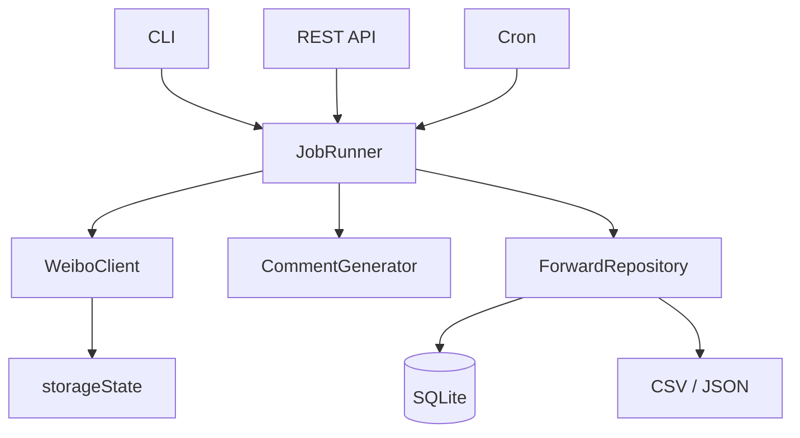

# weibo-auto-forward

[English](README.md) | 简体中文

[](LICENSE)

监控指定微博账号的新博文，用 Qwen（本机 CLI 或 HTTP API）生成转发评语，通过 Playwright 完成转发并记录。支持本机 CLI（`rules.yaml`）和多用户 HTTP API（含 Web 管理页）。

**与微博官方无关。** 自动化可能违反平台规则，存在限流或封号风险，请自行评估。

## 目录

- [界面截图](#界面截图)
- [环境要求](#环境要求)
- [快速开始（CLI）](#快速开始cli)
- [快速开始（Docker）](#快速开始docker)
- [工作流程](#工作流程)
- [部署方式](#部署方式)
- [配置说明](#配置说明)
- [Web 管理页](#web-管理页)
- [使用说明](#使用说明)
- [API](#api)
- [架构](#架构)
- [数据目录](#数据目录)
- [路线图](#路线图)
- [开发](#开发)
- [安全](#安全)
- [Star 趋势](#star-趋势)
- [许可证](#许可证)

## 界面截图

Web 管理页：`http://localhost:3000/admin/`（`npm run start:api` 或 `docker compose up` 之后访问）。

| 概览 | 账号 |
|:---:|:---:|
| 统计、执行/试运行、实时日志 | 创建账号、扫码登录、上传登录态 |
|  |  |

| 规则 | 历史 |
|:---:|:---:|
| 源 UID、条数、cron、评语风格 | 筛选记录、复制转发链接 |
|  |  |

**设置** — API 地址、中英文界面、评语模板与自定义 system prompt。


## 环境要求

- Node.js 18+
- Playwright Chromium：`npx playwright install chromium`
- [qwen CLI](https://github.com/QwenLM/qwen-code)（CLI 模式生成评语）
- Docker（可选，用于 API 部署与云端 Qwen）

## 快速开始（CLI）

```bash
git clone https://github.com/MrCare/weibo-auto-forward.git
cd weibo-auto-forward
npm install
npx playwright install chromium

cp .env.example .env
cp rules.yaml.example rules.yaml
# 编辑 rules.yaml：填写 sourceUid 与账号

npm run auth:login
npx tsx src/cli.ts forward --rule rule-brand --dry-run
npx tsx src/cli.ts forward --rule rule-brand
```

`--dry-run` 只生成评语，不执行转发。

## 快速开始（Docker）

```bash
cp .env.docker.example .env
# 设置 ADMIN_PASSWORD、QWEN_API_KEY

docker compose up -d --build
```

浏览器打开 `http://localhost:3000/admin/`。首次启动会根据 `ADMIN_USERNAME` / `ADMIN_PASSWORD` 创建 SQLite 与管理员账号。

## 工作流程

1. 读取规则（源 UID、条数上限、定时表达式）。
2. 用 Playwright 抓取源账号时间线。
3. 按 `(转发账号, 源 UID, mid)` 跳过已转发博文。
4. 调用 Qwen（CLI 或 DashScope 兼容 API）生成转发评语。
5. 在浏览器中完成转发并写入记录（CSV 和/或 SQLite）。

**CLI：** `rules.yaml`，登录态在 `data/accounts/` 下按账号存放。

**API：** SQLite 管理用户/账号/规则，租户目录存放 `storageState`，REST + Bearer API Key，规则可配 Cron，支持扫码登录。

## 部署方式

| | CLI | Docker / API |
|---|-----|----------------|
| 适用 | 本机、cron 定时 | 服务器、多人使用 |
| 配置 | `rules.yaml`、`.env` | `.env`（见 `.env.docker.example`） |
| 评语 | 本机 `qwen` CLI | `QWEN_API_KEY` |
| 登录 | `npm run auth:login` | 扫码或上传 `storageState` |

两种模式可同时使用（本机 CLI + 远端 API）。

### `rules.yaml` 示例

```yaml
accounts:
  - id: my-main

rules:
  - id: rule-brand
    forwardAccountId: my-main
    sourceUid: "1234567890"
    limit: 1
    enabled: true
    # schedule: "0 9 * * *"
```

## 配置说明

<details>
<summary>CLI（.env.example）</summary>

| 变量 | 说明 |
|------|------|
| `SOURCE_UID` | 源账号 UID（单源兼容模式） |
| `FORWARD_LIMIT` | 单次处理条数上限 |
| `HEADLESS` | 无头浏览器 |
| `DRY_RUN` | 只生成评语，不转发 |
| `QWEN_API_KEY` | 设置后改用 HTTP API 生成评语 |

</details>

<details>
<summary>Docker / API（.env.docker.example）</summary>

| 变量 | 默认 | 说明 |
|------|------|------|
| `PORT` | `3000` | 端口 |
| `ADMIN_USERNAME` | `admin` | 初始管理员用户名 |
| `ADMIN_PASSWORD` | `changeme` | 部署前请修改 |
| `ALLOW_REGISTER` | `true` | 是否允许注册 |
| `QWEN_API_KEY` | — | DashScope API Key |
| `QWEN_MODEL` | `qwen-plus` | 模型 |
| `CRON_ENABLED` | `true` | 规则定时任务 |
| `CRON_TZ` | `Asia/Shanghai` | Cron 时区 |
| `PUBLIC_BASE_URL` | `http://localhost:3000` | 扫码页根 URL |
| `HEADLESS` | `true` | 无头模式 |

</details>

Cron 示例：`0 9 * * *`（每天 9:00）、`0 */2 * * *`（每 2 小时）、`30 8 * * 1-5`（工作日 8:30）。

## Web 管理页

见 [界面截图](#界面截图)。可管理转发账号、规则与 Cron、手动/试运行任务、历史记录与评语设置，界面支持中英文。

扫码登录：创建账号 → `POST .../login-sessions` → 浏览器打开 `webUrl` → 微博 App 扫码 → 登录态写入 `data/tenants/`。

## 使用说明

完整的 Web 操作说明见 [docs/web-user-guide.zh-CN.md](docs/web-user-guide.zh-CN.md)，包含：

- 登录后台
- 登录微博账号
- 设置转发评语风格
- 设置转发规则
- `dry-run`
- 查看历史
- 一键复制链接

## API

登录后使用 `Authorization: Bearer <apiKey>` 或 `X-Api-Key` 请求头。

```bash
curl -s -X POST http://localhost:3000/api/v1/auth/login \
  -H 'Content-Type: application/json' \
  -d '{"username":"admin","password":"YOUR_PASSWORD"}'

export API_KEY="..."
export ACCOUNT_ID="..."

curl -s -X POST http://localhost:3000/api/v1/accounts \
  -H "Authorization: Bearer $API_KEY" \
  -H 'Content-Type: application/json' \
  -d '{"name":"my-main"}'

curl -s -X POST "http://localhost:3000/api/v1/accounts/$ACCOUNT_ID/login-sessions" \
  -H "Authorization: Bearer $API_KEY"

curl -s -X POST http://localhost:3000/api/v1/rules \
  -H "Authorization: Bearer $API_KEY" \
  -H 'Content-Type: application/json' \
  -d '{"forwardAccountId":"'"$ACCOUNT_ID"'","sourceUid":"1234567890","limit":1,"schedule":"0 9 * * *"}'

curl -s -X POST "http://localhost:3000/api/v1/rules/$RULE_ID/run" \
  -H "Authorization: Bearer $API_KEY" \
  -H 'Content-Type: application/json' \
  -d '{"dryRun":true}'
```

<details>
<summary>接口列表</summary>

| 方法 | 路径 | 说明 |
|------|------|------|
| `GET` | `/health` | 健康检查 |
| `POST` | `/api/v1/auth/register` | 注册 |
| `POST` | `/api/v1/auth/login` | 登录，返回 API Key |
| `POST` | `/api/v1/auth/rotate-key` | 轮换 API Key |
| `GET` | `/api/v1/me` | 当前用户 |
| `GET/PATCH` | `/api/v1/me/prompt-settings` | 评语风格 |
| `GET` | `/api/v1/prompt-templates` | Prompt 模板 |
| `GET/POST/DELETE` | `/api/v1/accounts` | 转发微博账号 |
| `POST` | `/api/v1/accounts/:id/login-sessions` | 发起扫码登录 |
| `GET` | `/api/v1/public/login-sessions/:id` | 轮询登录状态（需 token） |
| `GET/POST/PATCH/DELETE` | `/api/v1/rules` | 转发规则 |
| `POST` | `/api/v1/rules/:id/run` | 执行单条规则 |
| `POST` | `/api/v1/rules/run-all` | 执行全部已启用规则 |
| `GET` | `/api/v1/forward-records` | 转发记录 |
| `GET` | `/admin/` | Web 管理页 |

</details>

## 架构



| 模块 | 路径 | 职责 |
|------|------|------|
| JobRunner | `src/core/job-runner.ts` | 抓取 → 生成 → 转发 |
| WeiboClient | `src/core/playwright-weibo-client.ts` | 浏览器自动化 |
| CommentGenerator | `src/core/qwen-*-comment-generator.ts` | CLI / HTTP |
| 租户服务 | `src/services/tenant-forward-service.ts` | 按用户隔离执行 |
| API | `src/api/server.ts` | HTTP 与静态管理页 |

核心接口位于 `src/core/`：`WeiboClient`、`CommentGenerator`、`ForwardRepository`、`JobRunner`。

## 数据目录

以下路径不要提交到 Git（见 `.gitignore`）：

| 路径 | 用途 |
|------|------|
| `.env` | 密钥与配置 |
| `rules.yaml` | 实际规则 |
| `data/storageState.json` | 默认登录态 |
| `data/accounts/{id}/` | 多账号数据 |
| `data/app.db` | SQLite（API 模式） |
| `data/tenants/{userId}/` | 租户登录态 |
| `data/errors/` | 失败截图 |

## 路线图

**已完成：** CLI 与 `rules.yaml`、dry-run、核心抽象、SQLite 多用户 API、Web 管理页、Docker Compose、扫码登录、规则 Cron、Qwen CLI/API 评语、运行日志。

**计划中：** 任务队列与独立 Browser Worker；Postgres；指标与 Webhook；可插拔评语 Provider。

## 开发

```bash
npm install
npx playwright install chromium
cp .env.example .env
npm run typecheck
npm test
npm run start:api
```

见 [CONTRIBUTING.md](CONTRIBUTING.md)。

## 安全

- 不要提交 `.env`、`data/`、`rules.yaml` 及任何 `storageState.json`。
- 生产环境使用强 `ADMIN_PASSWORD`；不需要开放注册时关闭 `ALLOW_REGISTER`。
- `storageState` 等同于登录凭证，注意文件权限。
- 仓库内使用占位 UID（如 `1234567890`），真实 UID 仅放在本地配置中。

## Star 趋势

[](https://star-history.com/#MrCare/weibo-auto-forward&Date)

## 许可证

[MIT](LICENSE)
